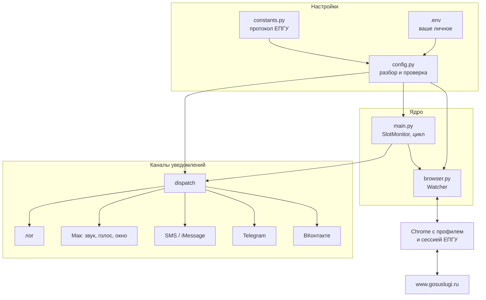
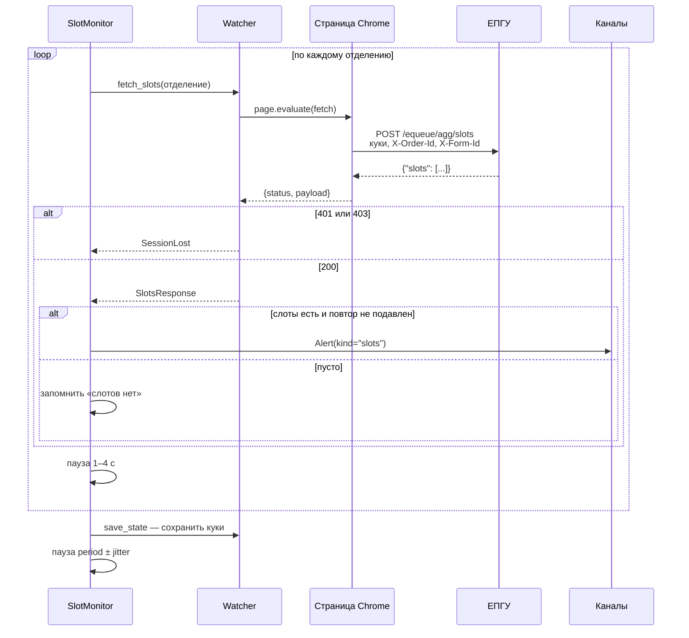
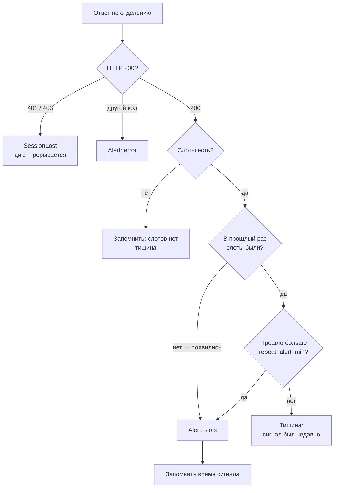
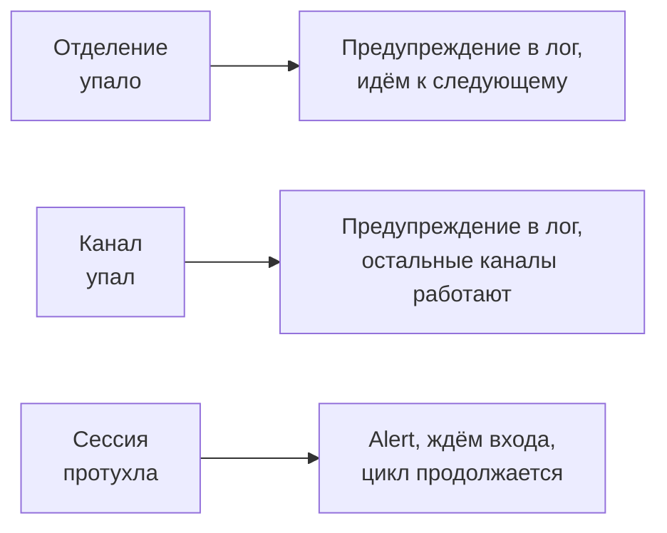
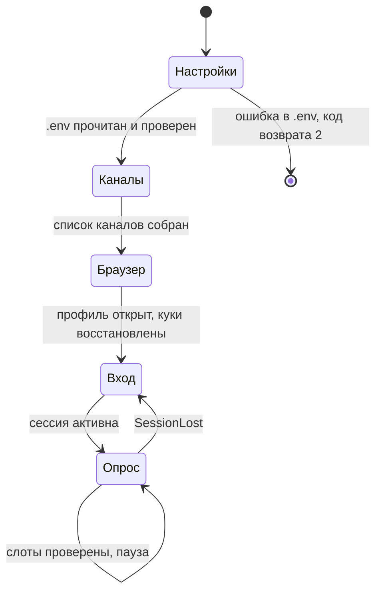
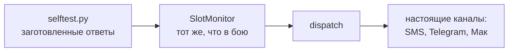

# Устройство

## Из чего собран



Разделение ответственности простое: `browser.py` умеет только доставать слоты и
ничего не знает про уведомления; `alerts/` умеет только доставлять и ничего не
знает про Госуслуги; `main.py` решает, что считать событием.

## Файлы

| Файл | Отвечает за |
|---|---|
| [constants.py](../src/gswatch/constants.py) | Внешние факты: адреса ручек, идентификаторы услуг, лимиты Telegram, флаги Chrome |
| [config.py](../src/gswatch/config.py) | Чтение `.env`, проверка значений, сборка `Config` |
| [browser.py](../src/gswatch/browser.py) | Окно Chrome, сессия, сам запрос слотов |
| [main.py](../src/gswatch/main.py) | Цикл опроса, решение «событие или нет», CLI |
| [selftest.py](../src/gswatch/selftest.py) | Репетиция всех уведомлений без обращения к порталу |
| [alerts/](../src/gswatch/alerts/) | Каналы доставки, по модулю на канал |

## Один цикл опроса



Запрос выпускается не из Python, а из самой страницы через `page.evaluate`.
Это принципиально: так он несёт подлинные куки, User-Agent и TLS-отпечаток
Chrome — расходиться нечему. Подробнее в [03_session.md](03_session.md).

## Когда поднимать шум

Наличие слотов ещё не событие: если они висят час, а сторож обходит отделения
каждые 8 минут, без подавления вы получите семь одинаковых сигналов.



Состояние живёт в двух словарях `SlotMonitor`, по коду отделения: было ли в
прошлый раз пусто и когда в последний раз шумели. Оно у каждого отделения своё —
слоты в Марфино не гасят сигнал по Марьиной Роще.

Важная деталь: **пустой ответ — не ошибка**. Портал отвечает `200` и
`"Operation completed"` с пустым списком, это штатное «мест нет».

## Живучесть

Ошибка одного отделения не должна ронять обход, а сбой доставки — мониторинг.
Поэтому исключения гасятся на трёх уровнях, и на каждом — по своей причине:



Единственное исключение, которое намеренно пробрасывается наверх, —
`SessionLost`: продолжать обход бессмысленно, пока не вошли заново.

## Что происходит при запуске



Проверка настроек идёт **до** запуска Chrome: незачем открывать окно и просить
логин, чтобы потом сообщить об опечатке в номере заявки.

## Режим репетиции

```bash
uv run gswatch --selftest
```

Прогоняет семь сцен на подставных ответах портала, но через настоящие каналы.
Подмена — только на границе с ЕПГУ:



Гоняется именно боевой `SlotMonitor`, а не копия логики — иначе проверка
проверяла бы саму себя. Заодно видно то, что вживую ловилось бы месяцами:
что подавление повторов работает и что шум поднимается только на слоты.
