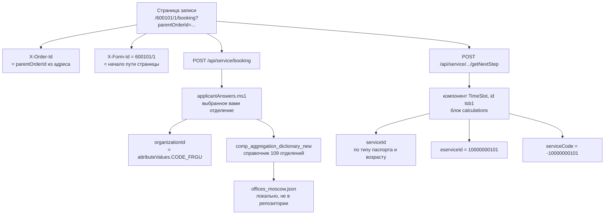

# Запрос к Госуслугам

Всё восстановлено из `artifacts/www.gosuslugi.ru.har` — лога реальной сессии
записи на приём.

## Как выглядит запрос

```http
POST https://www.gosuslugi.ru/api/lk/v1/equeue/agg/slots
Content-Type: application/json
X-Order-Id: <номер заявки>
X-Form-Id: 600101/1

{"organizationId":["<CODE_FRGU отделения>"],"serviceId":["409948235"],
 "eserviceId":"10000000101","attributes":[],"filter":null}
```

Ответ, когда мест нет:

```json
{"slots":[],"error":{"errorDetail":{"errorCode":0,"errorMessage":"Operation completed"}}}
```

Обратите внимание: это `200 OK` и «operation completed». Пустой список — не
ошибка, а штатный ответ.

## Почему POST, а не GET

Вопрос законный: запрос ничего не меняет, по логике REST это чтение.

Причины две. Первая — форма данных: тело содержит массивы и вложенный объект
`filter`, в query-строку это ложится плохо. Вторая, и более важная, — ответ
приходит с заголовком:

```
cache-control: max-age=86400
expires: <+24 часа>
```

Будь это GET, браузер и промежуточные кеши сутки отдавали бы протухшее «слотов
нет», и мониторинг стал бы бессмысленным. POST-ответы по умолчанию не кешируются.

Это не REST, а RPC поверх HTTP: соседние ручки (`/equeue/agg/book`,
`/nsi/v1/dictionary`) устроены так же.

## Откуда взялся каждый идентификатор



Главное открытие при разборе: портал не прячет эти числа — он присылает **сами
правила их вычисления**. В ответе `getNextStep` компонент `TimeSlot` содержит
блок `calculations` с выражениями вида:

```
$q1.value == 'Нового образца' && ($ai18_3.value == '' ...) ? '409948235' : ''
```

То есть `serviceId` выбирается по ответу `q1` (образец паспорта) и по тому,
заполнены ли блоки данных о ребёнке. Отсюда таблица:

| Тип загранпаспорта | `serviceId` | ключ в `.env` |
|---|---|---|
| нового образца, 18+ | `409948235` | `new_adult` |
| нового образца, до 18 | `10001971213` | `new_child` |
| старого образца, 18+ | `362737928` | `old_adult` |
| старого образца, до 18 (блок ai18) | `10000015182` | `old_child_ai18` |
| старого образца, до 18 (блок ai19) | `362737608` | `old_child_ai19` |

`eserviceId` там же константой: `10000000101`.

## Заголовки X-Order-Id и X-Form-Id

Их навешивает не человек, а Angular-интерцептор портала. В
`artifacts/main.4215f6773d792fab.js` он объявлен так:

```js
this.paths = ["nsi/v1/dictionary", "v1/equeue/agg/slots", "v1/equeue/agg/book"]
// ... setHeaders: {"X-ORDER-ID": ..., "X-FORM-ID": ...}
```

Раз портал их шлёт — шлём и мы. Имена вынесены в
[constants.py](../src/gswatch/constants.py).

## organizationId — это CODE_FRGU

Идентификатор отделения в теле запроса — не тот номер, что виден в интерфейсе.
Это атрибут `CODE_FRGU` из справочника МВД.

Ваш собственный код лежит в ответе `/api/service/booking`:
`applicantAnswers.ms1` → `attributeValues.CODE_FRGU`. Там же, в поле
`comp_aggregation_dictionary_new`, приходит и полный список отделений региона —
по Москве это 109 штук с адресами. Скрипт умеет подставлять из него читаемые
подписи, если положить выгрузку рядом под именем `offices_moscow.json`; в
репозиторий она не входит (см. [README](../README.md#справочник-отделений)).

Две ловушки при выборе:

- по одному адресу могут сидеть **два разных отдела** с разными кодами —
  следить надо за обоими, иначе половину слотов не увидите;
- название отдела не гарантирует его местоположение, сверяйтесь с полем
  `address`, а не с `title`.

## SLOTPERCENT

У каждого отделения в справочнике есть третий атрибут — `SLOTPERCENT`. Что о
нём известно точно:

- фронтенд его **не читает** — в девятимегабайтном `main.js` строка не
  встречается ни разу. Пользователю не показывается, значит нужен серверу;
- распределение по 109 отделениям на момент снятия лога: одно значение `-1.0`,
  88 нулей, у остальных 20 — от 0.92 до 11.25;
- у отделения с `0.0` реальный запрос слотов в тот же момент вернул пустой
  список. Не противоречит.

Похоже на процент свободных мест: значения ложатся на простые дроби
(1.47 ≈ 1/68, 3.33 ≈ 1/30), `-1.0` — вероятно «нет данных». Но это вывод по
одному снимку; неизвестно даже, считается процент по конкретной услуге или
суммарно по отделению.

Практический смысл: как дешёвый предварительный фильтр — годится, один
`POST /api/nsi/v1/dictionary` отдаёт свежие значения сразу по всем отделениям.
Как замена запросу слотов — нет.

## Авторизация

Только куки. Проверено: тот же запрос без них отвечает `401`.

Ни CSRF-токена, ни подписи, ни капчи в самом запросе нет. Но на странице
работает фингерпринт-телеметрия (`/api/mp-metrics/v1/gsm/raw-data`, protobuf) —
ещё один довод в пользу того, чтобы запрос уходил из настоящего браузера, а не
из HTTP-клиента. Об этом — [03_session.md](03_session.md).
