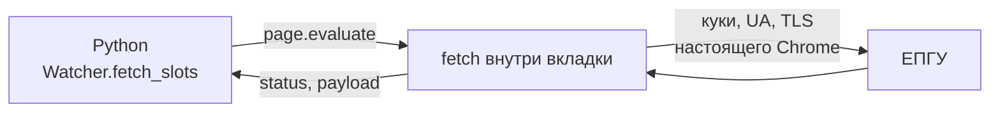
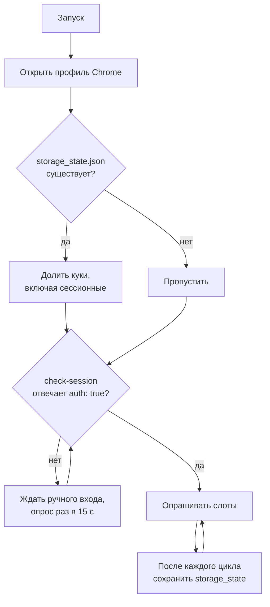
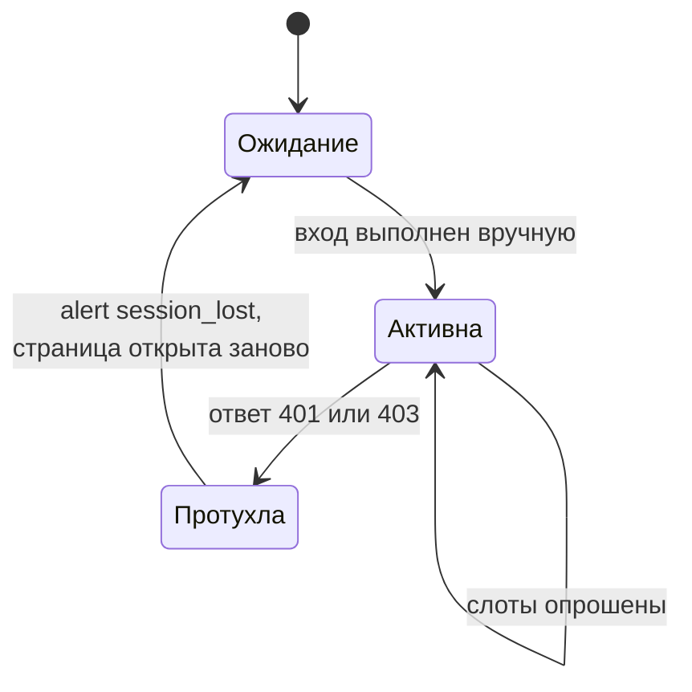

# Сессия и браузер

## Почему через Chrome, а не через HTTP-клиент

Первое, что приходит в голову — выгрузить куки из браузера и ходить обычным
`httpx`. Против этого три довода:

1. ручка пускает **только по кукам** живой сессии — без них `401`;
2. сессия ЕПГУ короткая, а продлевает её сам портал своими фоновыми запросами;
3. на странице работает фингерпринт-телеметрия — значит расхождение между
   «браузером», который логинился, и клиентом, который ходит за слотами,
   потенциально заметно.

Поэтому запрос выпускается **изнутри страницы**:



Куки, User-Agent, набор заголовков и TLS-отпечаток при этом буквально
браузерные — расходиться нечему.

## Почему канал chrome, а не Chromium

Playwright по умолчанию ставит свой Chromium. У него User-Agent содержит
`HeadlessChrome`, а `navigator.webdriver` равен `true` — два явных признака
автоматизации, видных любому скрипту на странице.

Поэтому в [constants.py](../src/gswatch/constants.py):

```python
CHROME_CHANNEL = "chrome"   # установленный Chrome, а не Chromium из поставки
CHROME_ARGS = ("--disable-blink-features=AutomationControlled",)
```

и окно **не headless**. Проверено на живом запуске: User-Agent совпадает с тем,
что в HAR настоящей сессии, а `navigator.webdriver` равен `false`.

## Куки при перезапуске

Здесь есть неочевидная ловушка. Профиль Chromium сохраняет только **постоянные**
куки; сессионные, без `Expires`, стираются при закрытии окна. Проверено
экспериментально: поставили две куки, закрыли профиль, открыли — осталась одна.

Какого типа куки авторизации у ЕПГУ, из HAR не видно: при экспорте лога куки
вырезали. Полагаться на удачу не хотелось, поэтому сторож дублирует состояние
сам:



Запись идёт после каждого цикла, а не только при выходе: если процесс убьют
через `kill -9`, обработчик выхода не отработает и сессия пропадёт.

Файл лежит в каталоге профиля (`~/.gswatch/chrome-profile/storage_state.json`),
создаётся с правами `600` и в репозиторий не попадает. **Это доступ к вашему
аккаунту Госуслуг** — не копируйте его никуда.

## Когда сессия всё-таки протухает



Перезапускать сторож не нужно. Он пришлёт уведомление, откроет страницу входа и
будет ждать, проверяя раз в 15 секунд, пока вы не залогинитесь. После этого
цикл продолжится сам.

## Почему нет Docker

Схема требует видимого окна и ручного входа, а это плохо совместимо с
контейнером. Размен сознательный: живучесть сессии важнее удобства упаковки.

Побочное следствие — сторож привязан к машине, на которой вы работаете. Но для
этой задачи так даже лучше: раз Мак всё равно включён и рядом, самым надёжным
каналом уведомления оказывается локальный сигнал, которому не нужна сеть. См.
[04_alerts.md](04_alerts.md).
