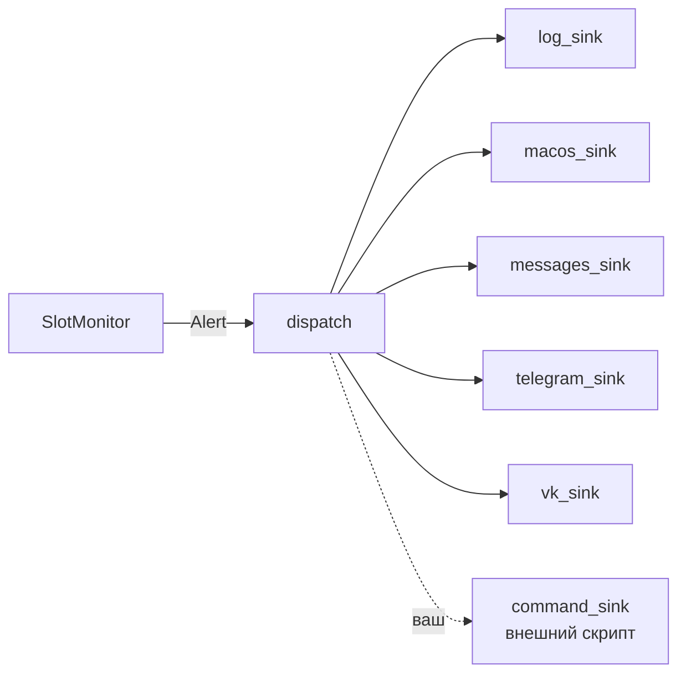
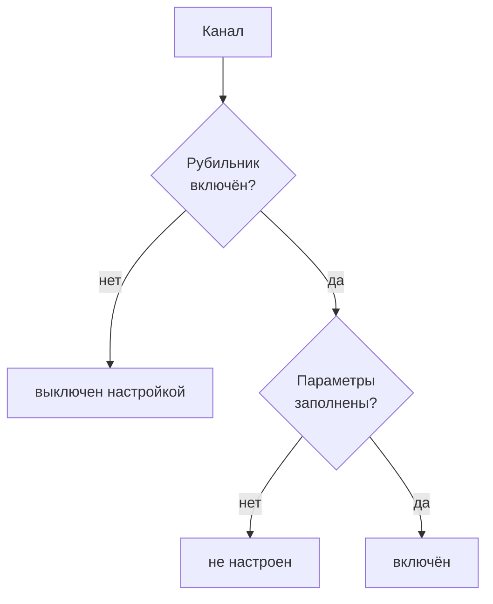
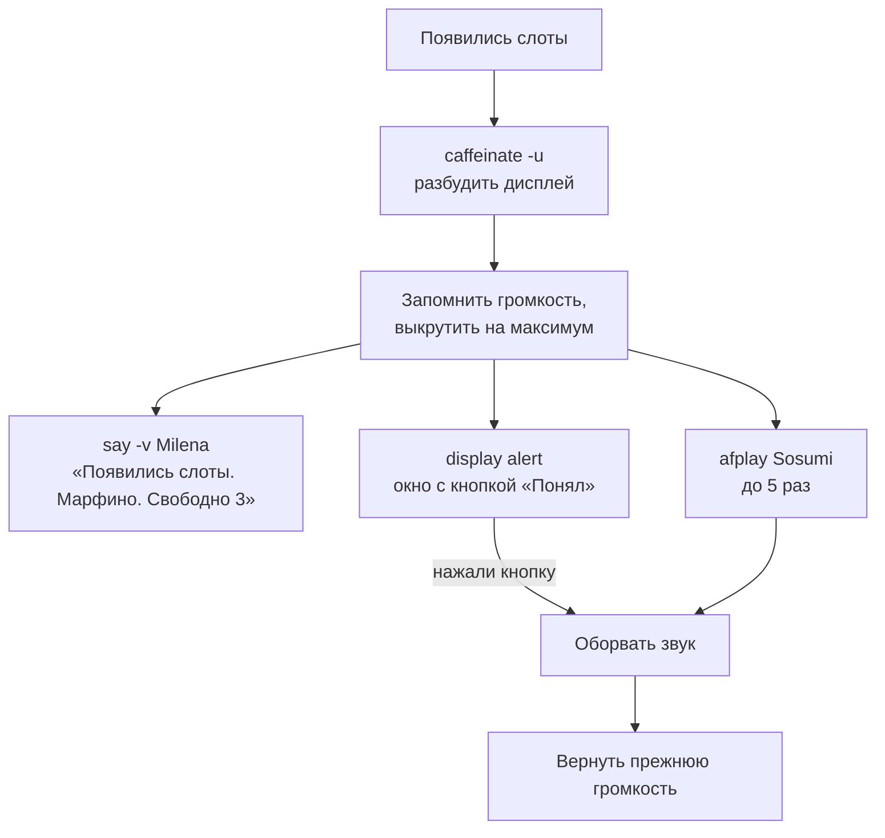
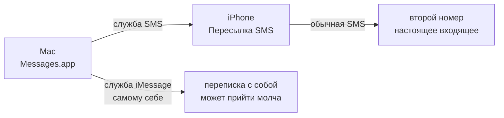

# Уведомления

## Устройство

Канал — это функция от одного `Alert`. Ядро мониторинга не знает, куда уходят
уведомления; каналы не знают, откуда взялся `Alert`.



`dispatch` вызывает каналы по очереди и гасит исключения: **упавший канал не
должен ронять сторожа и не должен мешать остальным**. Падение попадает в лог.

## Виды событий

| kind | Когда | Шум |
|---|---|---|
| `started` | сторож запущен | тихо |
| `slots` | появились свободные места | **громко** |
| `error` | портал ответил неожиданным кодом | тихо |
| `session_lost` | сессия протухла, нужен вход | тихо |

Громко шумит только `slots`. Будить дом сообщением «сторож запущен» незачем —
список громких видов задан константой `LOUD_ALERT_KINDS`.

Стартовое сообщение при этом всё равно отправляется во все каналы. Это
намеренно: так сразу видно, что канал настроен верно, а не выяснится через
месяц, когда появится слот и уведомление не придёт.

## Что включено

У каждого канала свой рубильник, который гасит его, **не стирая настроек**:

```ini
GSWATCH_ALERT_MAC=true
GSWATCH_ALERT_MESSAGES=false   # номер телефона при этом остаётся в .env
GSWATCH_ALERT_TELEGRAM=true
GSWATCH_ALERT_VK=true
```



Эти два состояния разделены намеренно: спутать «выключен» и «не настроен» —
значит месяц быть уверенным, что уведомление придёт, когда канал молча пуст.
При запуске сторож отчитывается по каждому:

```
Мак       включён: разбудить экран, громкость 100, голос Milena, звук Sosumi×5, модальное окно
Messages  выключен настройкой
Telegram  включён: чат 40•••••17
ВК        не настроен (нет токена или peer_id)
```

Лог рубильника не имеет: он включён всегда, иначе при отвале остальных каналов
сторож работал бы вслепую. Если кроме лога не осталось ничего — отдельное
предупреждение.

## Главный канал — локальный

Из России Telegram доступен непостоянно. Это не теория: во время одного из
прогонов самопроверки канал отвалился прямо посреди работы, причём **с
включённым VPN**:

```
WARNING Telegram недоступен: <urlopen error _ssl.c:1015: The handshake operation timed out>
```

Сторож это пережил и доработал до конца — но уведомление не дошло. Отсюда
вывод: канал, зависящий от сети, не может быть единственным.

При этом сторож обязан крутиться на вашем Маке — там окно Chrome с сессией.
Значит **в момент алерта Мак гарантированно включён и рядом**. Локальный сигнал
не зависит ни от сети, ни от блокировок, ни от VPN.



Три решения, которые стоит знать:

- **всё в фоновом потоке** — модальное окно ждёт нажатия, а цикл опроса ждать
  не должен; вызов канала возвращается мгновенно;
- **кнопка обрывает звук** — цикл `afplay` на каждой итерации смотрит, жив ли
  процесс окна;
- **громкость возвращается** — выкрутить на 100 и оставить так было бы
  свинством.

## SMS оказалась лучше iMessage

Неочевидный результат проверки. Отправка iMessage **самому себе** для тревоги
почти бесполезна: сообщение синхронизируется между устройствами как
**исходящее**, а не входящее, поэтому баннера и звука на телефоне может не быть.

А вот SMS на второй номер уходит через iPhone по «Пересылке SMS» и приходит
настоящим входящим — со звуком. Бонусом доходит даже без интернета на телефоне.



Служба выбирается явно (`GSWATCH_MESSAGES_SERVICE`) и **откатов не делает**:
AppleScript, в отличие от интерфейса приложения, не умеет переслать по SMS то,
что не ушло по iMessage. Попросили `iMessage` для номера, которого в нём нет —
сообщение повиснет красным «Not Delivered». Проверено вживую.

**Доставку проверить нельзя.** AppleScript лишь ставит сообщение в очередь и
возвращает успех — на заведомо несуществующем номере код возврата тоже `0`.
В лог попадёт только отказ самого скрипта: нет разрешения на автоматизацию
(`-1743`) или запрошенная служба не настроена.

## Подавление повторов

Логика — в [01_architecture.md](01_architecture.md#когда-поднимать-шум). Коротко:
сигнал даётся на **появление** слотов, а пока они не пропадали, повтор
подавляется `GSWATCH_REPEAT_ALERT_MIN` минут. Иначе при слотах, висящих час, вы
получите семь одинаковых сигналов.

## Добавить свой канал

Два пути, но оба требуют правки `build_sinks()` в
[alerts/`__init__`.py](../src/gswatch/alerts/__init__.py) — переменной
окружения для этого нет намеренно: команда из конфига означала бы запуск
произвольного процесса по содержимому файла, а это плохой размен ради удобства.

Проще — отдать алерт внешнему скрипту, ему прилетит JSON в stdin. Готовый
`make_command_sink` есть, но по умолчанию **не подключён**; добавьте строку:

```python
sinks.append(make_command_sink(["./notify.sh"]))
```

Основательнее — новый модуль в [alerts/](../src/gswatch/alerts/): функция от
одного `Alert`, туда же в `build_sinks()`. Требование одно — **не бросать
исключения наружу**; ошибки пишите в лог.

Если понадобится канал, который точно не зависит от блокировок и разбудит
ночью, — это звонок или SMS через российский шлюз (SMS.ru, SMSC, Zvonok).
Платно, но проще всего прикрутить именно через `command_sink`.

## Проверить, что всё дойдёт

```bash
uv run gswatch --selftest
```

Семь сцен на подставных данных, каналы настоящие. Подробности в
[01_architecture.md](01_architecture.md#режим-репетиции).
